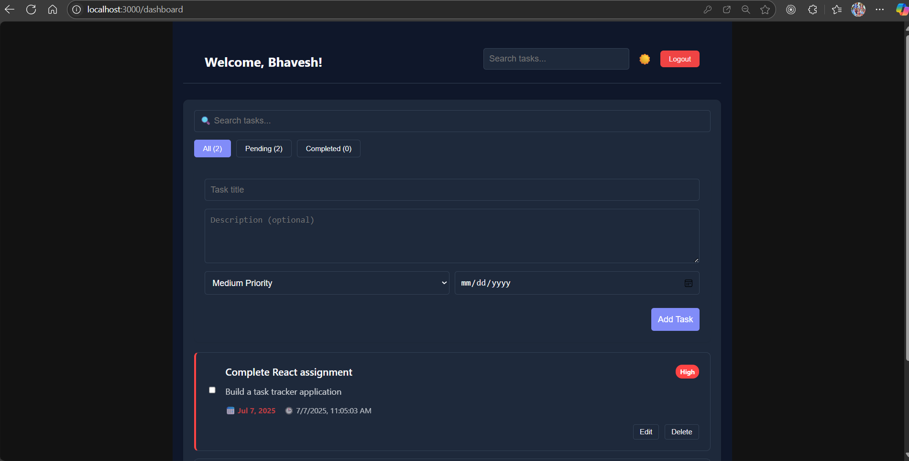

# TaskFlow Pro - Productivity Management System
## Description
The Personal Task Tracker is a React-based web application designed to help users organize and manage their daily tasks efficiently. With a clean and intuitive interface, users can add, edit, delete, and mark tasks as complete. The app persists tasks in the browser's local storage, ensuring your tasks remain available even after closing the browser.
*Modern task management with dark mode and secure authentication*
---

### Features
- Add new tasks with titles and optional descriptions
- Mark tasks as complete/incomplete with checkbox toggle
- Edit existing tasks to update their content
- Delete tasks you no longer need
- Responsive design that works on both desktop and mobile devices
- Local storage integration to save tasks between sessions
- Clean, modern UI with intuitive controls
- 


## 🌟 Key Features

### 🔐 Secure Authentication
- **User Login/Logout** with session persistence
- **Remember Me** functionality
- **Form Validation** for all inputs
- **Social Login** placeholders (Google/GitHub)

### 📝 Task Management
| Feature | Description |
|---------|-------------|
| **Create Tasks** | Add titles, descriptions, priorities |
| **Organize** | Filter by status (All/Pending/Completed) |
| **Edit** | Inline task modifications |
| **Dark Mode** | Eye-friendly theme toggle |

### 🛠 Technical Highlights
- **React 18** with functional components
- **Context API** for theme management
- **LocalStorage** persistence
- **Responsive Design** works on all devices

## 🚀 Getting Started

### Prerequisites
- Node.js v16+
- npm v8+
### Live Demo
[Add your deployed application link here]  
Example: [https://your-task-tracker-app.vercel.app](https://your-task-tracker-app.vercel.app)


## Screenshots



## Live Demo
[View Live Demo](https://your-deployed-app-url.vercel.app)  

### Installation
```bash
# Clone the repository
https://github.com/Bhavesh9908/task-tracker-app.git

# Navigate to project directory
cd taskflow-pro

# Install dependencies
npm install

# Start development server
npm start


![Another Screenshot])  
